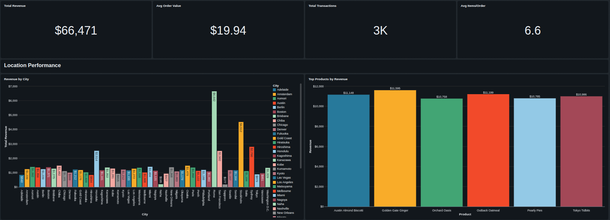
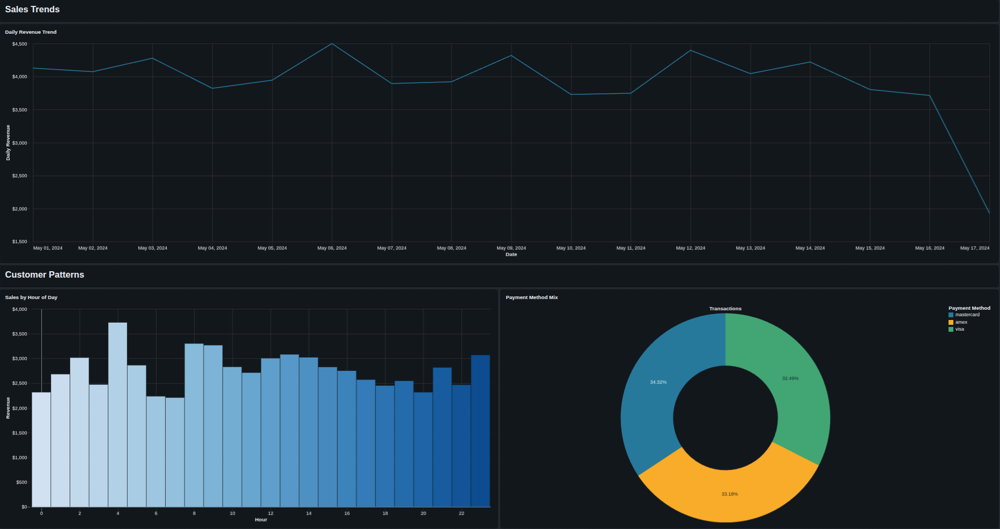
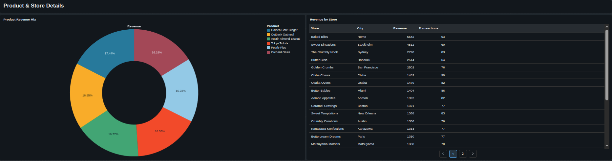

# 🍪 Bakery Sales: End-to-End Databricks Pipoeline

## 📌 Project Overview
This project demonstrates a production-grade **Medallion Architecture** (Bronze, Silver, Gold) pipeline using **Databricks** and **PySpark**. It transforms raw bakery transaction data into an executive dashboard for regional sales performance analysis.

## 🏗️ Architecture
The pipeline follows industry best practices for data engineering:
- **Bronze Layer:** Raw ingestion of `sales_transactions` and `customers` from Unity Catalog samples to Delta Lake.
- **Silver Layer:** Data cleansing (filtering nulls/test data), joining tables, and casting timestamps to optimized Date formats.
- **Gold Layer:** Business-level aggregation of total cookie sales per city.

## 🛠️ Tech Stack
- **Platform:** Databricks (Community Edition)
- **Engine:** Apache Spark (PySpark)
- **Storage:** Delta Lake (ACID transactions, Time Travel)
- **Governance:** Unity Catalog
- **Visualization:** Databricks SQL Dashboards

## 🚀 Key Insights
- **Data Integrity:** Implemented schema enforcement and filtered records where `quantity <= 0`.
- **Performance:** Leveraged Delta format for faster query execution in the Gold layer.
- **Business Value:** The final dashboard identifies top-performing franchises, allowing stakeholders to optimize regional supply chains.

## 📁 How to Use
1. Import the `.py` script into your Databricks Workspace.
2. Ensure you have access to the `samples.bakehouse` catalog.
3. Run the notebook to generate the `raydesel_bakery_project` schema.
